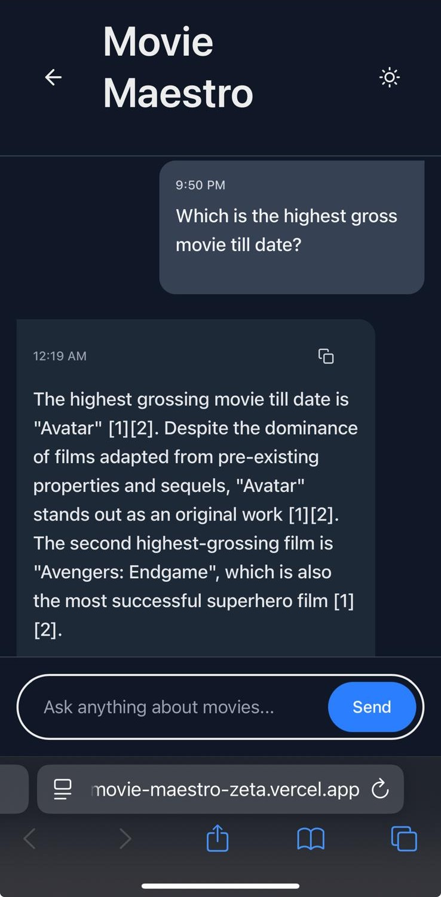
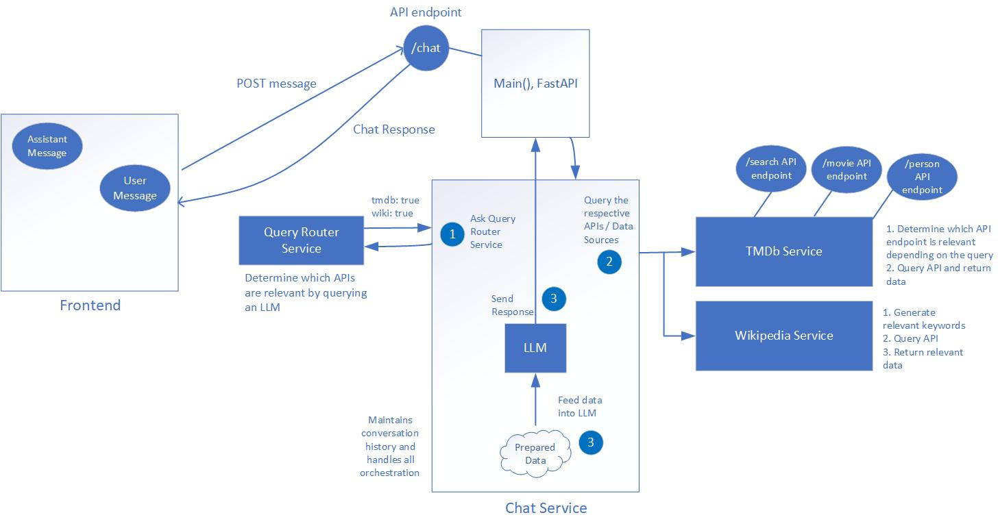

# Movie Maestro
Perplexity Take-Home Project for Amaan Khan

A specialized movie answer engine built for Perplexity's Residency Program. This application intelligently answers movie-related queries using data from multiple sources, providing detailed, accurate information with citations and visual content.

<div align="center">
  <iframe width="560" height="315" src="https://www.youtube.com/embed/P-_kBeSJrHk" title="Movie Maestro Demo" frameborder="0" allow="accelerometer; autoplay; clipboard-write; encrypted-media; gyroscope; picture-in-picture" allowfullscreen></iframe>
</div>

## Features

- **Multiple Data Sources**: Integrates TMDb and Wikipedia for comprehensive movie information
- **Intelligent API Selection**: Dynamically selects the appropriate TMDb API endpoint based on query context
    * Prevents unnecessary API calls and optimizes data retrieval
- **Advanced LLM Integration**: Powered by GPT-4 for natural language understanding and response generation
- **Citations & Sources**: All information is properly attributed with citations to original sources.This is done using Few-Shot Prompt Engineering techniques to ensure that answers are backed by a source and are not hallucinated.
- **Related Queries**: Suggests related questions users might want to explore
- **Rich Media Support**: Includes relevant movie images, posters, and other visual content
- **Conversation History**: Supports multi-turn and follow-up queries by maintaining context
- **Asynchronous Processing**: Parallel data fetching from multiple sources using `async`/`await`, improving the response time for complex queries
- **Responsive UI**: Modern, user-friendly interface that works across devices.
    * Mobile-friendly design with Tailwind CSS
    * Dynamically adapts to resizing of the window
    * Dark/Light Theme: Users have the option to choose a Dark or Light theme.
    * Real-time typing indicates during response generation

    * Example of the UI on a phone device
    

## Tech Stack

- **Backend**:
  - Python with FastAPI
  - LangChain for LLM orchestration
  - TMDb and Wikipedia APIs

- **Frontend**:
  - TypeScript
  - Next.js with App Router
  - Tailwind CSS for styling

- **Deployment**:
  - Frontend: Vercel
  - Backend: Render

## Setup Instructions

### Prerequisites
- Node.js (v18+)
- Python (3.10+)
- TMDb API key

### Backend Setup

#### Using Conda
```bash
# Create and activate environment
conda create -n plex-env python=3.11
conda activate plex-env

# Install dependencies
conda env update -f backend/environment.yml

# Set up environment variables
cp backend/.env.example backend/.env
# Edit .env and add your API keys
```

#### Using Pip
```bash
# Create and activate virtual environment
python -m venv venv
source venv/bin/activate  # On Windows: venv\Scripts\activate

# Install dependencies
pip install -r backend/requirements.txt

# Set up environment variables
cp backend/.env.example backend/.env
# Edit .env and add your API keys
```

### Frontend Setup
```bash
# Install dependencies
cd frontend
npm install

# Create environment file
cp .env.example .env.local
# Configure environment variables
```

## Running the Application

### Backend
```bash
cd backend
python -m src.main
```

### Frontend
```bash
cd frontend
npm run dev
```

Visit `http://localhost:3000` to use the application.

## Architecture



The application follows a client-server architecture:

1. User queries are processed by the frontend and sent to the backend API
2. The backend identifies query intent and selects appropriate data sources
    * Decides if it should use TMDb, Wikipedia, or both
    * For TMDb, it decides which API endpoint to use. It uses an LLM call to determine type of information it requires: movie, person, rating, etc. And then makes the correct respective API call to retrieve that information.
    * For Wikipedia, it first determines 3 relevant keywords that it can use to search for in Wikipedia, and then gathers that information
3. Relevant data is fetched from TMDb and/or Wikipedia 
    * Due to Wikipedia having a lot of information, it retrieves only introduction paragraph and an additional 20 sentences. However, this can easily be changes to retrieve everything. Or if I had a vector DB of the Wikipedia snapshot available, then it could perform a more intelligent search/retreival to only retrieve relevant chunks of data from the Wikipedia article.
4. GPT-4 generates a comprehensive answer using retrieved information
5. The response, including citations and related queries, is returned to the frontend
6. The frontend presents the information in an engaging, accessible format. **The UI is dynamic to view well on various devices like a laptop, tablet, or phone device.**

### Detailed Backend Architecture Overview

#### Data Flow & Workflow

##### Query Processing Workflow

1. **User Input**
   * User enters a movie-related query in the frontend
   * Query is sent to backend via API call

2. **Query Routing** (Backend - QueryRouterService)
   * LLM analyzes the query to determine appropriate data sources
   * Decides whether to use TMDb, Wikipedia, or both
   * Returns routing decision to ChatService
   * **NOTE**: For now, it always chooses to query Wikipedia since it has a lot of relevant information that may be useful. However, in the LLM response it may not use that information if the LLM does not deem it necessary. However, it does decide if TMDb is relevant.

3. **Data Collection** (Parallel Processing)
   * **TMDb Processing Branch**:
     1. TMDb query analyzer determines query intent (movie/person/comparison)
     2. System searches for movie titles or person names
     3. Appropriate TMDb API endpoints are called based on query type
     4. Movie/person data is formatted with citations
     5. Relevant images are extracted
   * **Wikipedia Processing Branch**:
     1. Wikipedia query analyzer identifies search terms
     2. System searches Wikipedia for relevant articles
     3. Article content is fetched and summarized
     4. Citations are created with source links
     5. Images are extracted if available

4. **Response Generation**
   * Data from all sources is combined
   * LLM (GPT-4) generates comprehensive answer with citations
   * Citations are filtered to include only those referenced in the response
   * Related follow-up queries are generated based on context

5. **Response Delivery**
   * Response with citations, images, and related queries is returned to frontend
   * Frontend renders the response with proper formatting
   * Images are displayed in gallery format
   * Citations are presented as interactive elements
   * Related queries appear as clickable suggestions

##### Conversation Management

1. Conversation history is maintained by ChatService
2. Context from previous questions is used for:
   * Following up on previous movies/people mentioned
   * Generating more relevant follow-up queries
   * Providing continuity in multi-turn conversations